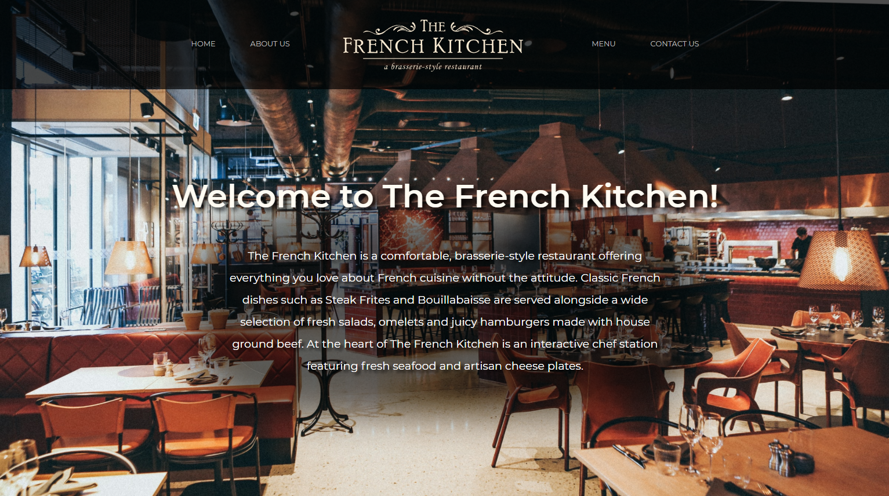

# The French Kitchen - Pure Vanilla JS SPA

## Welcome! 👋

Thanks for checking out this repository.

View the live preview at: https://senciz.github.io/Restaurant-Page/

## The challenge

Let’s use what we’ve learned and take a chance to continue practicing DOM manipulation by dynamically rendering a simple restaurant homepage! By the end, we are going to be using JavaScript alone to generate the entire contents of the website!

**Note: DOM elements should be created using JavaScript but styling can be done in a separate CSS file.**
